# TD4CPU
## 简介
   这一台由74系列数字电路芯片组成的计算机，满足冯·诺依曼提出的计算机的五大基本构件，包括运算器、存储器、输入设备、输出设备和控制器。其核心是一个由10个74芯片构成的4bit CPU，包含了ALU（算术逻辑单元）、ID（指令译码器）、MUX（数据选择器）、PC（程序计数器）、以及寄存器A、B和输出寄存器。
   与该CPU连接的ROM（只读存储器）用于存储程序，由拨码开关进行编程，可使用12个指令，最多编写16条指令程序。该项目的设计方案来自于日本工程师度波郁（Iku Watanami）的著作《用10个IC轻松介绍CPU设计》，并由来自广州的创元素团队复刻并讲解。由于创元素制复刻的套件不太符合笔者的电路设计审美。故在此基础上制作了更加美观，指示灯清晰的版本。
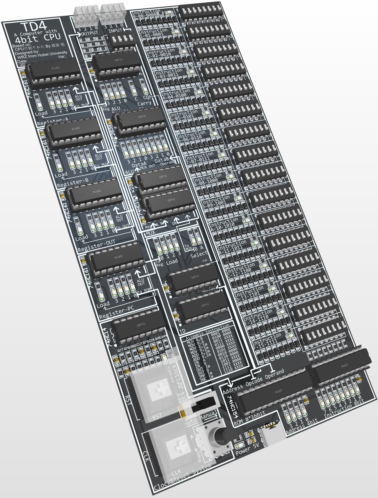

## 电路原理介绍
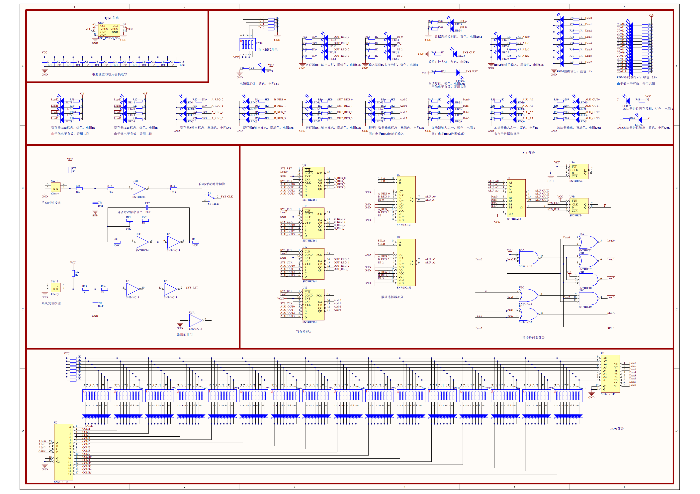
### CPU部分
CPU部分，原作者度波郁提供了一个网址用于仿真这台计算机：
	https://vanya.jp.net/td4/
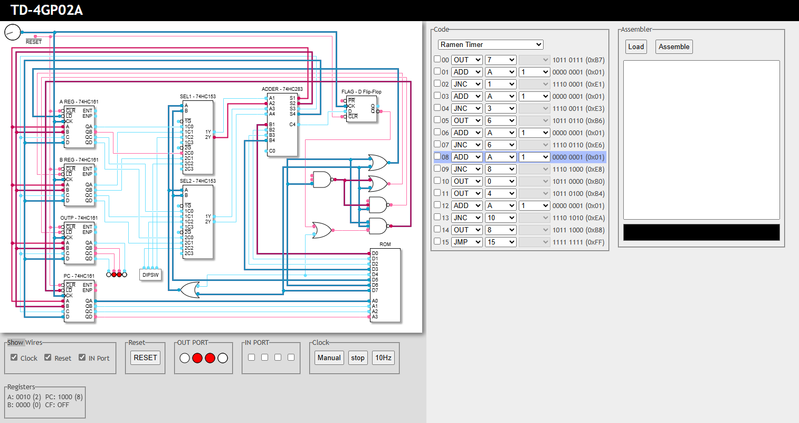
其中4片74HC161分别构成了4个Register（寄存器）A，B，OUT，PC，分别用于数据的临时存储、输出以及程序计数器（Program Counter）。
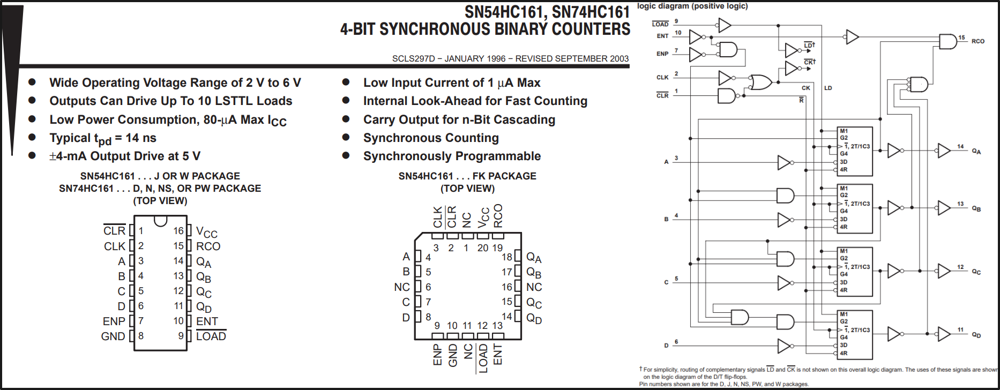
74HC161是一个4位2进制可预置的同步加法计数器，其中寄存器A、B、OUT仅使用了其预置个功能，即锁存。而寄存器PC还使用了其计数功能用于递增程序地址。锁存受ID模块控制，计数时钟来源于主时钟。

然后有2片74HC153作为MUX（数据选择器），用于选择进入ALU的数据来源。
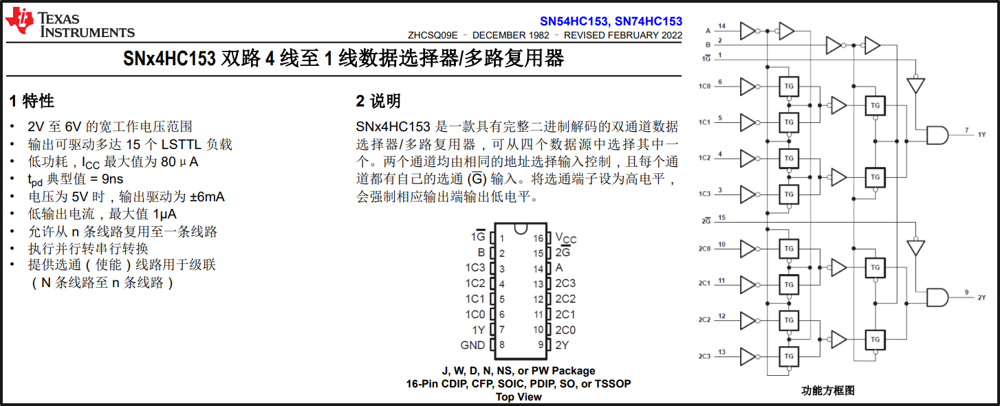
74HC153是一个2路4选1多路选择器，通过2个进行组合，形成了一个4bit 4选1数据选择器。输入分别接了寄存器A、B、外部输入IN和GND。数据选择受ID控制。

接着是由1片74HC283和1片74HC74构成的ALU（算数逻辑单元），其中283负责运算，将数据选择器送来的4bit数据与指令中的Operand（操作数）相加并得到结果和进位。而74HC74负责锁存进位标志位（Carry Flag）。
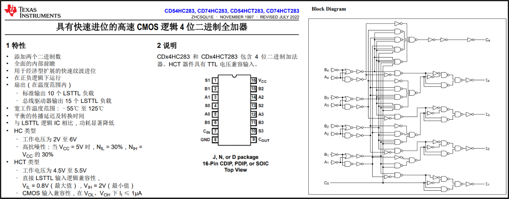
74HC283是一个4位2进制全加器，可直接得到两个数相加的结果并进位，74HC74是一个双D触发器，在时钟的上升沿锁住进位标志，并可以影响下一条指令的运行。

最后是由1片74HC32和74HC10构成的ID（指令译码器），用于将指令中的Opcode（操作码）译码成对应的操作，通过控制MUX（数据选择器）和4个寄存器的Load，即在时钟来时寄存器是否装载来自ALU的结果。
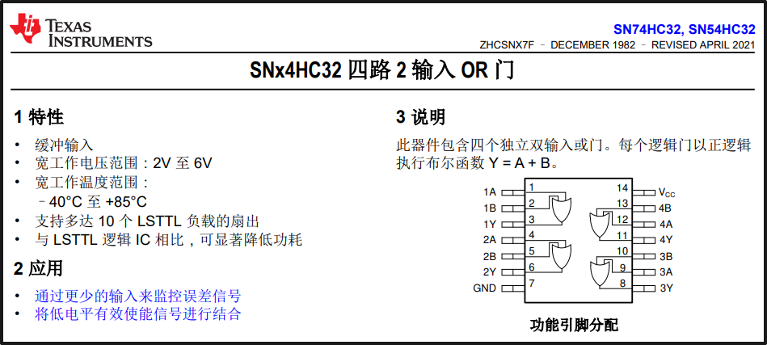
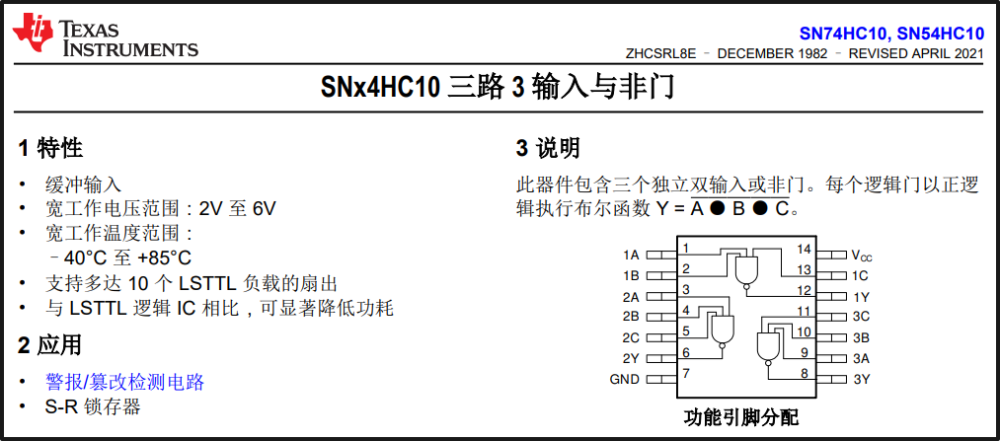
74HC32是四路2输入或门，74HC10是三路3输入与非门。

### ROM部分
ROM部分，由1片74HC540、1片74HC154、16个8位拨码开关、16*8=128个二极管、以及上拉电阻组成。
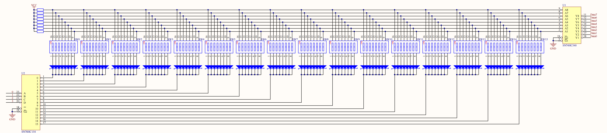
其中由74HC154作为地址译码器，选择对应的拨码开关+二极管组合，即选择了对应的数据。
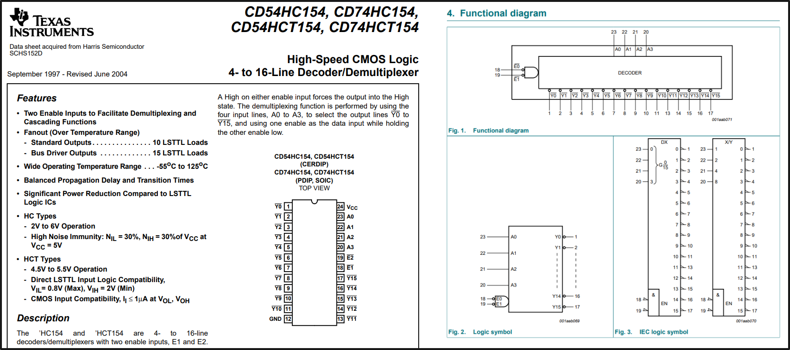
74HC154是一个4-16线译码器，输入二进制的0~15，对应的一个输出会置低，从而选中拨码开关+二极管组合，如果拨码开关的某位向上，即开关闭合，则使二极管导通，对应的线为低电平；反之拨码开关向下时，由于上拉电阻，对应的数据线则是高电平。

而74HC540用于将数据反相以及增强驱动。
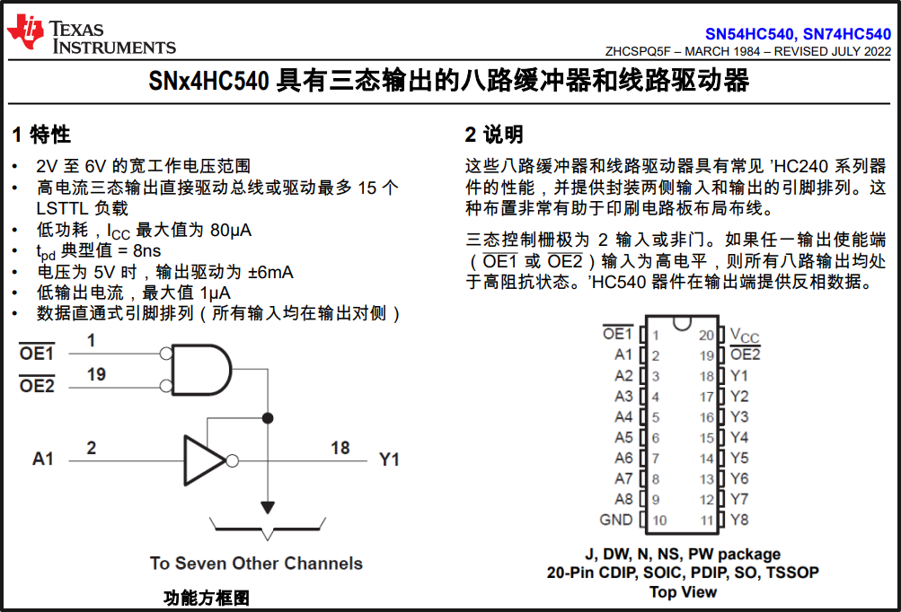
74HC540是一个反相输出的八路缓冲器，即8个并列的非门由于开关向上是0，向下是1，不符合一般的认知，所以对数据进行反相，同时上拉电阻产生的高电平驱动能力不足（10KΩ上拉电阻），以及经过二极管产生的低电平电位不够低（0.7V左右，肖特基二极管0.5V），所以需要增强数据线的驱动能力。

最后是系统时钟与复位部分。

系统时钟采用了手动、自动时钟两种模式，通过开关切换。
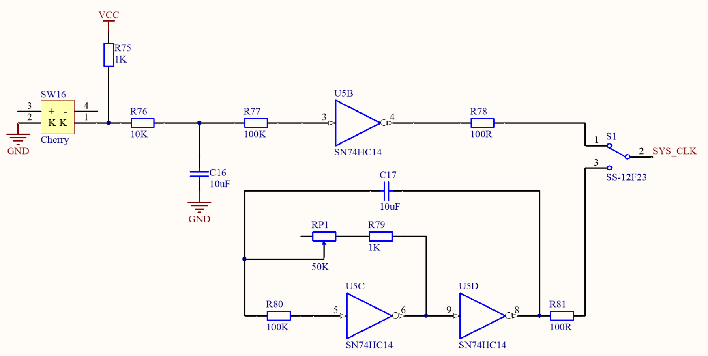
手动模式通过按键按下接地形成低电平，抬起时因为上拉电阻形成高电平。同时通过电容以及施密特触发器74HC14进行消抖。
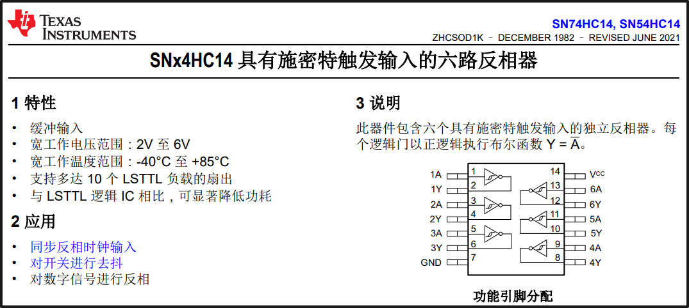
74HC14是一个六路的具有施密特触发输入的反相器，同时参与了自动时钟的震荡、手动时钟的消抖、复位的消抖和反相等多个电路。

自动时钟采用了一种门电路组成的多谐振荡器，通过RC电路充放电形成震荡。同时，通过调节电位器的值可以更改振荡频率。

复位电路与手动时钟电路差不多，只是多了个反相。
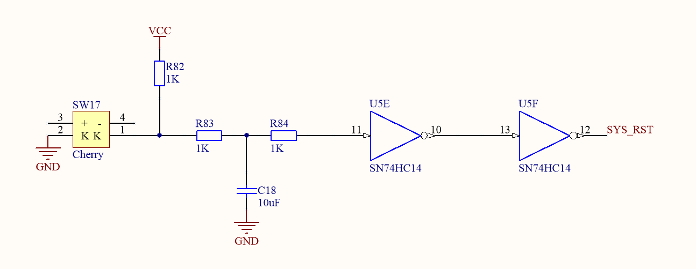
这套电路一共用了74HC14的5个反相器，剩一个没用。

## 指令集

TD4 中定义了十二种类型的指令，这里汇总了所有指令的列表。

由于TD4为4bitCPU，所以每条指令都由4bit的Opcode（操作码）和4bit的Operand（操作数）组成，一共8bit。这里用多种汇编助记符表示

| 助记符 | 指令 | 解释 | 
| MOV A,B | 0001 0000 | 将 B 寄存器传送到寄存器A。不受C标志影响，执行后C标志置0。 |

|MOV B,A|0100 0000|将 A 寄存器转移到寄存器B。不受C标志影响，执行后C标志置0。|

MOV A,Im		0011 XXXX	

	将立即数XXXX传送到寄存器A。

	不受C标志影响，执行后C标志置0。

MOV B,Im		0111 XXXX	

	将立即数XXXX传送到寄存器B。

	不受C标志影响，执行后C标志置0。

ADD A,Im		0000 XXXX	

	将立即数XXXX累加到寄存器A。

	不受C标志影响，执行后发生进位C标志置1。

ADD B,Im		0101 XXXX	

	将立即数XXXX累加到寄存器B。

	不受C标志影响，执行后发生进位C标志置1。

IN A			0010 0000

	将输入端口数据传输到寄存器A。

	不受C标志影响，执行后C标志置0。

IN B			0110 0000

	将输入端口数据传输到寄存器B。

	不受C标志影响，执行后C标志置0。

OUT Im		1011 XXXX

	将立即数XXXX传输到输出端口。

	不受C标志影响，执行后C标志置0。

OUT B		1001 0000

	将寄存器B传输到输出端口。

	不受C标志影响，执行后C标志置0。

JMP Im		1111 XXXX

	程序跳转到立即数指示的地址XXXX。

	不受C标志影响，执行后C标志置0。

JNC			1110 XXXX

	当C标志为0时，程序跳转到立即数所指示的地址。

	反之什么都不做。执行后C标志置0。
